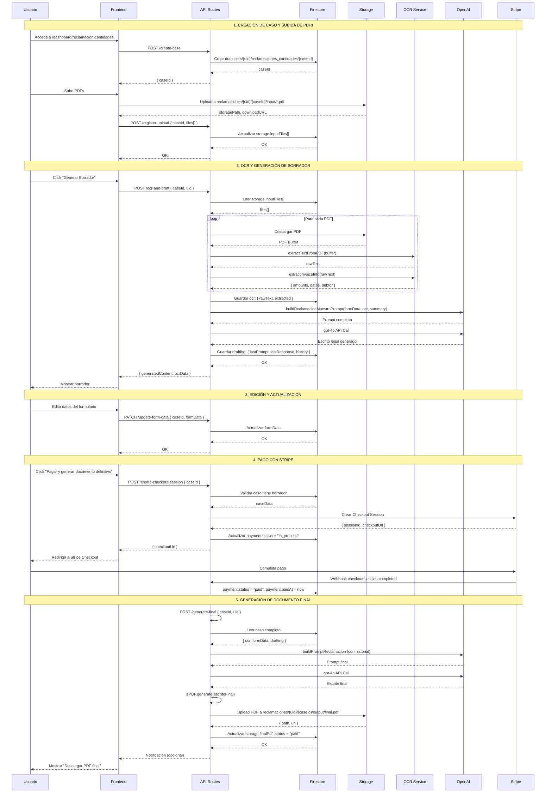
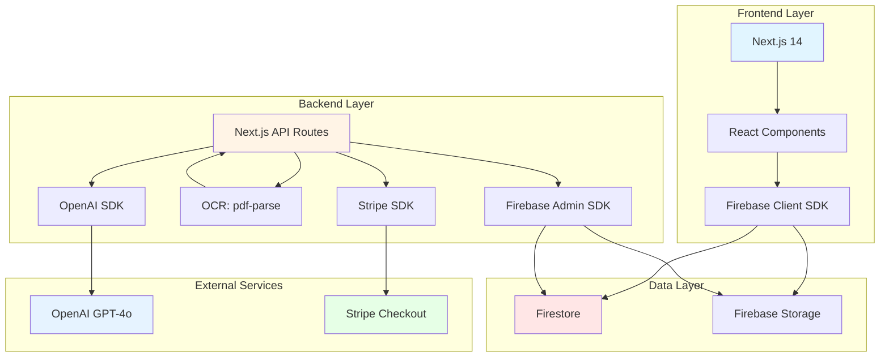
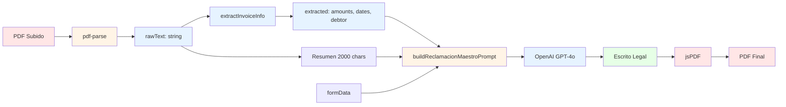

# 📊 Diagrama de Arquitectura: Reclamación de Cantidades

## Flujo Completo del Sistema

```mermaid
graph TB
    subgraph "Frontend (Next.js)"
        A[Usuario] --> B[Dashboard Reclamación]
        B --> C[ReclamacionProcessSimple Component]
        C --> D[Subir PDFs]
        C --> E[Ver Borrador]
        C --> F[Pagar]
    end

    subgraph "API Routes (Next.js)"
        D --> G1[POST /api/reclamaciones-cantidades/create-case]
        D --> G2[POST /api/reclamaciones-cantidades/register-upload]
        E --> G3[POST /api/reclamaciones-cantidades/ocr-and-draft]
        E --> G4[PATCH /api/reclamaciones-cantidades/update-form-data]
        F --> G5[POST /api/reclamaciones-cantidades/create-checkout-session]
        G5 --> G6[POST /api/stripe/webhook]
    end

    subgraph "Firebase Storage"
        G2 --> H1[reclamaciones/{uid}/{caseId}/input/*.pdf]
        G6 --> H2[reclamaciones/{uid}/{caseId}/output/final.pdf]
    end

    subgraph "Firestore Database"
        G1 --> I1[users/{uid}/reclamaciones_cantidades/{caseId}]
        G2 --> I1
        G3 --> I1
        G4 --> I1
        G6 --> I1
        I1 --> I2[status: draft/paid]
        I1 --> I3[ocr: rawText, extracted]
        I1 --> I4[formData: datos usuario]
        I1 --> I5[drafting: borrador]
        I1 --> I6[payment: estado Stripe]
        I1 --> I7[storage: referencias]
    end

    subgraph "Procesamiento OCR"
        G3 --> J1[pdf-parse]
        J1 --> J2[extractTextFromPDF]
        J2 --> J3[extractInvoiceInfo]
        J3 --> I3
    end

    subgraph "OpenAI Integration"
        G3 --> K1[buildReclamacionMaestroPrompt]
        K1 --> K2[gpt-4o API]
        K2 --> K3[Escrito Legal Generado]
        K3 --> I5
    end

    subgraph "Stripe Payment"
        G5 --> L1[Stripe Checkout Session]
        L1 --> L2[Usuario Paga]
        L2 --> G6
        G6 --> L3[Verificar Pago]
        L3 --> G7[POST /api/reclamaciones-cantidades/generate-final]
    end

    subgraph "Generación Final"
        G7 --> M1[OpenAI: Escrito Final]
        M1 --> M2[jsPDF: Generar PDF]
        M2 --> H2
        M2 --> I1
    end

    style A fill:#e1f5ff
    style B fill:#e1f5ff
    style C fill:#e1f5ff
    style I1 fill:#fff4e6
    style H1 fill:#ffe6e6
    style H2 fill:#ffe6e6
    style K2 fill:#e6f3ff
    style L1 fill:#e6ffe6
```

## Estructura de Datos en Firestore

```mermaid
graph LR
    A[users/{uid}] --> B[reclamaciones_cantidades/{caseId}]
    B --> C[status: draft/paid]
    B --> D[ocr: rawText + extracted]
    B --> E[formData: datos usuario]
    B --> F[drafting: prompt + response + history]
    B --> G[payment: status + Stripe IDs]
    B --> H[storage: inputFiles[] + finalPdf]
    B --> I[legalMeta: jurisdicción + versión]

    style A fill:#fff4e6
    style B fill:#ffe6e6
    style C fill:#e6f3ff
    style D fill:#e6f3ff
    style E fill:#e6f3ff
    style F fill:#e6f3ff
    style G fill:#e6ffe6
    style H fill:#ffe6e6
    style I fill:#f0e6ff
```

## Flujo de Negocio Detallado



## Componentes y Tecnologías



## Estructura de Storage

```mermaid
graph TD
    A[Firebase Storage Root] --> B[reclamaciones_cantidades/]
    B --> C[{uid}/]
    C --> D[{caseId}/]
    D --> E[input/]
    D --> F[output/]
    E --> E1[original_1.pdf]
    E --> E2[original_2.pdf]
    E --> E3[...]
    F --> F1[final.pdf]

    style A fill:#ffe6e6
    style B fill:#fff4e6
    style C fill:#e6f3ff
    style D fill:#e6ffe6
    style E fill:#f0e6ff
    style F fill:#f0e6ff
```

## Estados del Caso

```mermaid
stateDiagram-v2
    [*] --> draft: Crear caso
    draft --> draft: Subir PDFs
    draft --> draft: Generar borrador
    draft --> waiting_payment: Usuario solicita pago
    waiting_payment --> paid: Stripe confirma pago
    paid --> paid: Generar PDF final
    draft --> error: Error en OCR/AI
    waiting_payment --> error: Error en pago
    paid --> error: Error generando PDF
    error --> draft: Reintentar
```



## Endpoints API y sus Responsabilidades

```mermaid
graph LR
    A[POST /create-case] --> A1[Crear caso en Firestore]
    B[POST /register-upload] --> B1[Registrar archivos en Firestore]
    C[POST /ocr-and-draft] --> C1[OCR + Generar borrador]
    D[PATCH /update-form-data] --> D1[Actualizar datos usuario]
    E[GET /[caseId]] --> E1[Obtener caso completo]
    F[POST /create-checkout-session] --> F1[Crear sesión Stripe]
    G[POST /generate-final] --> G1[Generar PDF final]
    H[POST /stripe/webhook] --> H1[Procesar pago + trigger final]

    style A fill:#e1f5ff
    style B fill:#e1f5ff
    style C fill:#fff4e6
    style D fill:#e1f5ff
    style E fill:#e1f5ff
    style F fill:#e6ffe6
    style G fill:#ffe6e6
    style H fill:#e6ffe6
```

## Flujo de Datos: OCR → OpenAI → PDF



## Seguridad y Permisos

```mermaid
graph TB
    A[Usuario Autenticado] --> B[Firebase Auth]
    B --> C{Validar uid}
    C -->|OK| D[Acceso a caso]
    C -->|NO| E[Denegar acceso]
    
    D --> F[Firestore Rules]
    F --> G[users/{uid}/reclamaciones_cantidades/{caseId}]
    G --> H[request.auth.uid == resource.data.uid]
    
    D --> I[Storage Rules]
    I --> J[reclamaciones/{uid}/**]
    J --> K[request.auth.uid == uid]

    style A fill:#e1f5ff
    style B fill:#fff4e6
    style F fill:#ffe6e6
    style I fill:#ffe6e6
    style H fill:#e6ffe6
    style K fill:#e6ffe6
```

---

## Resumen de la Arquitectura

### **Frontend**
- **Componente Principal**: `ReclamacionProcessSimple.tsx`
- **Página**: `/dashboard/reclamacion-cantidades`
- **Funciones**: Subir PDFs, ver borrador, pagar, descargar PDF final

### **Backend (API Routes)**
- **8 Endpoints** especializados para el flujo completo
- **OCR**: Extracción de texto con `pdf-parse`
- **AI**: Generación con OpenAI GPT-4o
- **PDF**: Generación con `jsPDF`

### **Base de Datos**
- **Firestore**: `users/{uid}/reclamaciones_cantidades/{caseId}`
- **Storage**: `reclamaciones_cantidades/{uid}/{caseId}/input|output/`

### **Integraciones Externas**
- **OpenAI**: Generación de escritos legales
- **Stripe**: Procesamiento de pagos
- **Firebase**: Almacenamiento y autenticación

### **Flujo Principal**
1. **Crear caso** → Firestore
2. **Subir PDFs** → Storage + Firestore
3. **OCR + Borrador** → OpenAI → Firestore
4. **Pago** → Stripe → Webhook
5. **PDF Final** → OpenAI → jsPDF → Storage + Firestore


